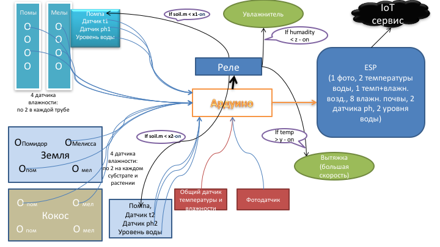

# Конфигурация и алгоритмы



## Полигон 1 (P1)

#### Емкость с раствором
* pin A11 (INPUT) - датчик температуры (**P1.TempWater**) 
  * если (**P1.TempWater** < **_TempWater_min_**) : **Alarm(TimeStamp;вода в емкости 1 слишком холодная)**, но поливать все равно можно
  * если (**P1.TempWater** > **_TempWater_max_**) : **Alarm(TimeStamp;вода в емкости 1 слишком теплая)**, но поливать все равно можно
  * если (**P1.TempWater** > **_TempWater_sos_**) : **Alarm(TimeStamp;вода в емкости 1 горячая, помпа заблокирована)**, блокировка помпы **P1.RelayPump_BLOCKSTATE**=TRUE, нельзя поливать растения кипятком
  * если (**_TempWater_min_** < **P1.TempWater** < **_TempWater_max_**) и (**P1.RealyPump_BLOCKSTATE**=TRUE) : **Alarm(TimeStamp;температура воды в емкости 1 нормализована, помпа разблокирована)**, разблокировка помпы **P1.RelayPumpBLOCKSTATE**=FALSE
    * **_TempWater_min_**, **_TempWater_max_**, **_TempWater_sos_** - глобальные константы для всей установки
* pin A13 (INPUT) - pH метр (**P1.pH**)
  * если (**P1.pH** < **_P1.pH_min_**) или (**P1.pH** > **_P1.pH_max_**) : **Alarm(TimeStamp;недопустимый pH в емкости 1, помпа заблокирована)** и блокировка помпы **P1.RelayPump_BLOCKSTATE**=TRUE, нельзя поливать растения кислотой или щелочью
  * если (**_P1.pH_min_** < **P1.pH** < **_P1.pH_max_**) и (**P1.RealyPump_BLOCKSTATE**=TRUE) : **Alarm(TimeStamp;pH воды в емкости 1 нормализован, помпа разблокирована)**, разблокировка помпы **P1.RelayPumpBLOCKSTATE**=FALSE
    * **_P1.pH_min_** и **_P1.pH_max_** - локальные константы для полигона 1 (может быть на разных полигонах полив разными растворами с разными допусками по pH)
* pin A9 (INPUT) - датчик уровня жидкости (**P1.WaterLevel**)
  * если (**P1.WaterLevel** < **_P1.WaterLevel_min_**) : **Alarm(TimeStamp;в емкости 1 снизился уровень)** и установка признака **P1.WaterLevelLOW**=TRUE
  * если (**P1.WaterLevel**  > **_P1.WaterLevel_max_**)  и (**P1.WaterLevelLOW**=TRUE) : **Alarm(TimeStamp;емкость 1 наполнена)** и сброс признака **P1.P1.WaterLevelLOW**=FALSE
    * **_P1.WaterLevel_min_**, **_P1.WaterLevel_max_** - локальные константы для полигона 1 (могут быть разные емкости и по разному установлены датчики)
* pin 40 (OUTPUT) - реле помпы (**P1.RelayPump**)
  * если требуется включить помпу (**P1.RelayPumpONOFF**=ON) и она разблокирована (**P1.RelayPumpBLOCKSTATE**=FALSE) : включение помпы **Event(TimeStamp;помпа P1 включена)** на **_P1.RelayPump_worktime_** секунд, по окончании сброс **P1.RelayPumpONOFF**=OFF и **Event(TimeStamp;помпа P1 выключена)**
  * если требуется включить помпу (**P1.RelayPumpONOFF**=ON) и она заблокирована (**P1.RelayPumpBLOCKSTATE**=TRUE) : **Alarm(TimeStamp;полив полигона 1 невозможен, помпа заблокирована)**, сброс **P1.RelayPumpONOFF**=OFF
    * **_P1.RelayPump_worktime_** - локальная константа для полигона 1 (может быть разная конфигурация полива - помпы, форсунки, и разный расход раствора)

#### Датчики влажности
* pin A1 (INPUT) - датчик влажности трубы "Помидоры" (**P1.Soil1**)
* pin A2 (INPUT) - датчик влажности трубы "Помидоры" (**P1.Soil2**)
* pin A3 (INPUT) - датчик влажности трубы "Клубника" (**P1.Soil3**)
* pin A4 (INPUT) - датчик влажности трубы "Клубника" (**P1.Soil4**)
  * если (среднее(**P1.Soil1**, **P1.Soil2**, **P1.Soil3**, **P1.Soil4**) < **_P1.Soil_min_**) : включить реле помпы **P1.RelayPumpONOFF**=ON и установить флаг проверки повышения влажности **P1.SoilUPCheck**=TRUE и вычислить время проверки **P1.SoilUPCheckTime**=now()+**P1.SoilUpCheckPeriod**
    * **_P1.XXXXX_** - локальные константы для полигона 1 (могут быть разные условия влажности между полигонами для разных растений)
  * если (**P1.SoilUPCheck**==TRUE) и (now()>=**P1.SoilUpCheckTime**) проверить среднюю влажность, если меньше **_P1.Soil_min_** : **Alarm(TimeStamp;команда на включение помпы была подана, но влажность не увеличилась)** и увеличить счетчик ошибок **P1.SoilUPError**++, иначе сбросить счетчик ошибок **P1.SoilUPError**=0 и выключить необходимость проверки **P1.SoilUPCheck**==FALSE
  * если **P1.SoilUPError**>2 заблокировать помпу **Alarm(TimeStamp;команда на включение помпы была подана три раза, но влажность не увеличилась - помпа заблокирована)** и **P1.RelayPumpBLOCKSTATE**=TRUE
  * если (среднеквадратичная ошибка(**P1.Soil1**, **P1.Soil2**, **P1.Soil3**, **P1.Soil4**) > **_SoilErr_max_**) : **Alarm(TimeStamp;неравномерная влажность на полигоне 1 - требуется обслуживание)**
    * **_SoilErr_max_** - глобальная константа для всей установки 

## Полигон 2 (P2)

#### Емкость с раствором

Алгоритмы контроля такие же

* pin A12 (INPUT) - датчик температуры (**P2.TempWater**) 
* pin A14 (INPUT) - pH метр (**P2.pH**)
* pin A10 (INPUT) - датчик уровня жидкости (**P2.WaterLevel**)
* pin 41 (OUTPUT) - реле помпы R (**P2.RelayPump**)

#### Датчики влажности
* pin A5 (INPUT) - датчик влажности субстрата "Земля" (**P2.Soil1**)
* pin A6 (INPUT) - датчик влажности субстрата "Земля" (**P2.Soil2**)
* pin A7 (INPUT) - датчик влажности субстрата "Кокос" (**P2.Soil3**)
* pin A8 (INPUT) - датчик влажности субстрата "Кокос" (**P2.Soil4**)

## Общая освещенность
* pin A15 (INPUT) - фотодатчик (**Light**), длительность непрерывного света (**LightONtime**), длительность непрерывной темноты (**LightOFFtime**)
  * если текущее значение (**LightONtime** > **_LightONtime_max_**) : **Alarm(TimeStamp;день длится слишком долго)**, лампа не гаснет
  * если текущее значение (**LightOFFtime** > **_LightOFFtime_max_**) : **Alarm(TimeStamp;ночь длится слишком долго)**, лампа не зажигается
  * если в момент переключения освещения прошедшее (**LightONtime** < **_LightONtime_min_**) : **Alarm(TimeStamp;день был слишком короткий)**, лампа зажглась, но слишком быстро снова погасла
  * если в момент переключения освещения прошедшее (**LightOFFtime** < **_LigthOFFtime_min_**) : **Alarm(TimeStamp;ночь была слишком короткая)**, лампа погасла, но слишком быстро снова зажглась
    * **_LightONtime_max_**, **_LightOFFtime_max_**, **_LightONtime_min_**, **_LightOFFtime_min_** - глобальные константы для всей установки
  
## Общая температура и влажность

Датчик влажности и температуры DHT22

#### Влажность (Humidity)

* pin 2 (INPUT) - влажность (**Humidity.Val**), время в течение которого влажность меньше порога **Humidity.LOWtime**, больше порога **Humidity.HIGHtime**
* pin 42 (OUTPUT) - реле включения увлажнителя (**Humidity.Relay**)
  * если (**Humidity.Val** < **_Humidity.Val_ref_**) : ВКЛючить увлажнитель **Humidity.RelayONOFF**=ON и **Event(TimeStamp;увлажнитель включен)**
  * если (**Humidity.Val** => **_Humidity.Val_ref_**) : ВЫКЛючить увлажнитель **Humidity.RelayONOFF**=OFF и **Event(TimeStamp;увлажнитель выключен)**
  * если (**Humidity.LOWtime** > **_Humidity.LOWtime_max_**) : **Alert(TimeStamp;низкая влажность слишком долго)**
  * если (**Humidity.HIGHtime** > **_Humidity.HIGHtime_max_**) : **Alert(TimeStamp;высокая влажность слишком долго)**

#### Температура (Temp)

* pin 2 (INPUT) - температура (**Temp.Val**), время в течение которого температура меньше порога **Temp.LOWtime**, больше порога **Temp.HIGHtime**
* pin 43 (OUTPUT) - реле включения вытяжки (**Temp.RelayVent**)
  * если (**Temp.Val** < **_Temp.Val_ref_**) : ВЫКЛючить вытяжку **Temp.RelayVentONOFF**=OFF и **Event(TimeStamp;вытяжка включена)**
  * если (**Temp.Val** => **_Temp.Val_ref_**) : ВКЛючить вытяжку **Temp.RelayVentONOFF**=ON и **Event(TimeStamp;вытяжка выключена)**
  * если (**Temp.LOWtime** > **_Temp.LOWtime_max_**) : **Alert(TimeStamp;низкая температура слишком долго)**
  * если (**Temp.HIGHtime** > **_Temp.HIGHtime_max_**) : **Alert(TimeStamp;высокая температура слишком долго)**

## Сводная таблица коммутации сигнальных контактов

| pin | назначение |
|- | - |
| A1 | P1.Soil1 |
| A2 | P1.Soil2 |
| A3 | P1.Soil3 |
| A4 | P1.Soil4 |
| A5 | P2.Soil1 |
| A6 | P2.Soil2 |
| A7 | P2.Soil3 |
| A8 | P2.Soil4 |
| A9 | P1.WaterLevel |
| A10 | P2.WaterLevel |
| A11 | P1.TempWater |
| A12 | P2.TempWater |
| A13 | P1.pH |
| A14 | P2.pH |
| A15 | Light |
| 2 | Humidity.Val, Temp.Val |
| 40 | P1.RelayPump |
| 41 | P2.RelayPump |
| 42 | Humidity.Relay |
| 43 | Temp.RelayVent |

## Формат строки CSV файла для записи на SD карту

```
TimeStamp;Light_ONOFF;Humidity.Val;Temp.Val;P1.Soil1;P1.Soil2;P1.Soil3;P1.Soil4;P2.Soil1;P2.Soil2;P2.Soil3;P2.Soil4;P1.WaterLevel;P2.WaterLevel;P1.TempWater;P2.TempWater;P1.pH;P2.pH;P1.RelayPump_ONOFF;P1.RelayPump_BLOCKSTATE;P2.RelayPump_ONOFF;P2.RelayPump_BLOCKSTATE;Humidity.Relay_ONOFF;Temp.RelayVent_ONOFF
```

## Формат обмена данными с ESP

#### От системы в облако
Передача данных телеметерии
```
T:D;копия строки записи в CSV файл
```
Передача оповещений Alert
```
T:A;текст Alert
```
Передача событий Event
```
T:E;текст Event
```

#### От облака к системе

Будет определено позднее